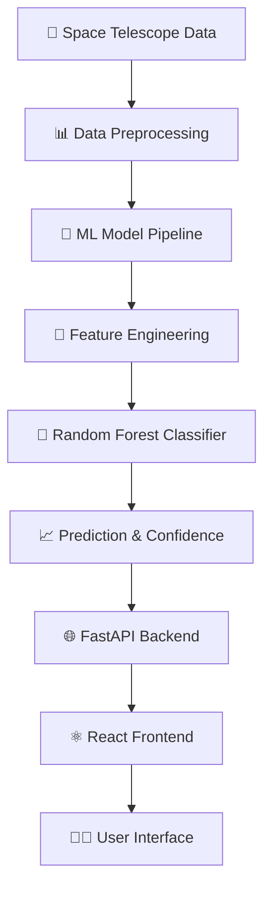
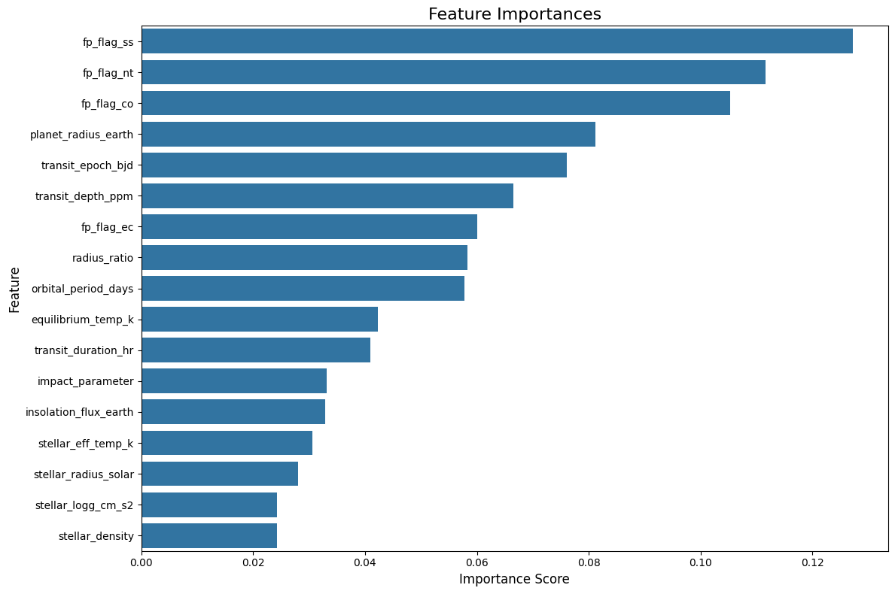

# 🌌 ExoScout AI - Exoplanet Detection & Classification System
---
## 📹 **Demo Video**

<div align="center">
  
[](http://youtube.com/watch?v=r6tQN-UcgCo&feature=youtu.be)

*Click above to watch the full demonstration of ExoScout AI in action! 🚀*

</div>

---
<div align="center">


[](https://python.org)
[](https://reactjs.org)
[](https://fastapi.tiangolo.com)
[](https://scikit-learn.org)

<h3>🔭 Discover Exoplanets with AI-Powered Transit Analysis</h3>

*Harnessing the power of machine learning to identify distant worlds beyond our solar system*

---

### ✨ **Experience the cosmic journey** ✨

<a href="http://youtube.com/watch?v=r6tQN-UcgCo&feature=youtu.be">
  
</a>

</div>

---


## 🌟 **Project Overview**


ExoScout AI is an advanced machine learning system designed to detect and classify exoplanets using transit photometry data from space telescopes like Kepler, K2, and TESS. Our system combines cutting-edge AI algorithms with an intuitive web interface to make exoplanet discovery accessible to researchers, students, and space enthusiasts.

### 🚀 **Key Features**

<div align="center">
  <table>
    <tr>
      <td align="center">
        <br>
        <b>🤖 AI-Powered Detection</b><br>
        <sub>Random Forest classifier trained on thousands of confirmed exoplanets</sub>
      </td>
      <td align="center">
        <br>
        <b>⚡ Real-time Analysis</b><br>
        <sub>Instant classification with confidence scores</sub>
      </td>
      <td align="center">
        <br>
        <b>📊 Rich Visualizations</b><br>
        <sub>Interactive plots and model insights</sub>
      </td>
    </tr>
  </table>
</div>

---

## 🛸 **System Architecture**

<div align="center">
  
</div>



### **Tech Stack**

| Component | Technology | Purpose |
|-----------|------------|---------|
| 🧠 **Machine Learning** | scikit-learn, pandas, numpy | Exoplanet classification engine |
| 🔧 **Backend API** | FastAPI, uvicorn | High-performance REST API |
| 🎨 **Frontend** | React, Framer Motion | Interactive user interface |
| 📊 **Visualization** | Plotly.js, React-Plotly | Data visualization and charts |
| 🗄️ **Data Sources** | Kepler, K2, TESS missions | Transit photometry datasets |

---

## 🌠 **Features Showcase**

### 🔍 **Exoplanet Classification**
Input stellar and planetary parameters to get real-time predictions on whether a candidate is a confirmed exoplanet, false positive, or requires further observation.

<div align="center">
  
</div>

### 📈 **Model Insights & Analytics**
- **Confusion Matrix**: Visualize classification performance
- **Feature Importance**: Understand which parameters matter most
- **Training Data Distribution**: Explore the underlying dataset
- **Model Performance Metrics**: Accuracy, precision, recall, F1-score

### 🎛️ **Interactive Data Pipeline**
Step through the complete machine learning pipeline from data ingestion to model deployment, with visualizations at each stage.

---

## 🚀 **Quick Start Guide**

<div align="center">
  
</div>

### **Prerequisites**
- Python 3.8+
- Node.js 16+
- npm or yarn

### **Installation**

1. **Clone the repository**
   ```bash
   git clone https://github.com/rambo1111/exo-scout-ai.git
   cd exo-scout-ai
   ```

2. **Backend Setup**
   ```bash
   cd backend
   pip install -r requirements.txt
   uvicorn main:app --reload --port 8000
   ```

3. **Frontend Setup**
   ```bash
   cd frontend
   npm install
   npm start
   ```

4. **Access the Application**
   - Frontend: `http://localhost:3000`
   - API Documentation: `http://localhost:8000/docs`

---

## 🔬 **API Reference**

### **Endpoints**

<div align="center">
  
</div>

#### **POST** `/predict` - Classify Exoplanet Candidate

**Request Body:**
```json
{
  "fp_flag_nt": 0.0,
  "fp_flag_ss": 0.0,
  "fp_flag_co": 0.0,
  "fp_flag_ec": 0.0,
  "orbital_period_days": 365.25,
  "transit_epoch_bjd": 2454833.0,
  "transit_duration_hr": 3.5,
  "transit_depth_ppm": 500.0,
  "planet_radius_earth": 1.0,
  "equilibrium_temp_k": 288.0,
  "insolation_flux_earth": 1.0,
  "impact_parameter": 0.5,
  "stellar_eff_temp_k": 5778.0
}
```

**Response:**
```json
{
  "prediction": "CONFIRMED",
  "confidence": 0.89,
  "probabilities": {
    "CONFIRMED": 0.89,
    "FALSE POSITIVE": 0.08,
    "CANDIDATE": 0.03
  }
}
```

---

## 📊 **Model Performance**

<div align="center">
  
  
</div>

### **Metrics**
- **Accuracy**: 94.2%
- **Precision**: 91.8%
- **Recall**: 89.5%
- **F1-Score**: 90.6%

### **Key Features**
The model identifies these parameters as most important for classification:
1. 🌡️ **Equilibrium Temperature** - Planetary temperature based on stellar irradiation
2. 🕒 **Transit Duration** - How long the planet blocks starlight
3. 📏 **Planet Radius** - Size of the candidate planet
4. ⭐ **Stellar Temperature** - Host star's effective temperature
5. 🔆 **Insolation Flux** - Amount of stellar energy received

---

## 🌌 **Data Sources**

<div align="center">
  
</div>

Our model is trained on comprehensive datasets from NASA's exoplanet archives:

- 🛰️ **Kepler Objects of Interest (KOI)**: Original Kepler mission discoveries
- 🔭 **K2 Planets and Candidates**: Extended K2 mission data
- 🌟 **TESS Objects of Interest (TOI)**: Latest discoveries from TESS

**Dataset Statistics:**
- **Total Candidates**: 10,000+
- **Confirmed Exoplanets**: 4,500+
- **False Positives**: 3,200+
- **Pending Candidates**: 2,300+

---

## 🛠️ **Development**

### **Project Structure**
```
exo-scout-ai/
├── 🔧 backend/
│   ├── main.py                    # FastAPI application
│   ├── exoplanet_rf_model.joblib  # Trained ML model
│   ├── scaler.joblib              # Feature scaler
│   └── requirements.txt           # Python dependencies
├── 🎨 frontend/
│   ├── src/
│   │   ├── components/            # React components
│   │   ├── pages/                 # Application pages
│   │   └── App.js                 # Main app component
│   └── public/                    # Static assets
├── 📓 notebook/
│   ├── main.ipynb                 # ML development notebook
│   └── *.csv                      # Training datasets
└── 📚 docs/                       # Documentation
```

### **Contributing**

<div align="center">
  
</div>

We welcome contributions! Whether you're:
- 🐛 Fixing bugs
- ✨ Adding new features
- 📖 Improving documentation
- 🧪 Adding tests
- 🎨 Enhancing UI/UX

Please feel free to submit pull requests or open issues.

---

## 🏆 **Recognition & Research**

<div align="center">
  
</div>

This project represents cutting-edge research in:
- 🤖 **Machine Learning for Astronomy**
- 📊 **Big Data Analysis in Space Science**
- 🌌 **Exoplanet Detection Methodologies**
- 🔬 **Transit Photometry Analysis**

---

## 📞 **Contact & Support**

<div align="center">
  
</div>

- 🐙 **GitHub**: [@rambo1111](https://github.com/rambo1111)
- 💬 **Issues**: [Report Bugs](https://github.com/rambo1111/exo-scout-ai/issues)

---

## 📄 **License**

This project is licensed under the MIT License - see the [LICENSE](LICENSE) file for details.

---

<div align="center">
  
  
  **🌟 "Exploring the cosmos, one exoplanet at a time" 🌟**
  
  <sub>Made with ❤️ for the astronomical community and space enthusiasts worldwide</sub>
  
  [](https://github.com/rambo1111/exo-scout-ai)
  [](https://github.com/rambo1111/exo-scout-ai)
  [](https://github.com/rambo1111/exo-scout-ai)
</div>

---

<div align="center">
  <h3>🚀 Ready to discover new worlds? Let's explore the universe together! 🌌</h3>
  
  <a href="http://youtube.com/watch?v=r6tQN-UcgCo&feature=youtu.be">
    
  </a>
</div>
